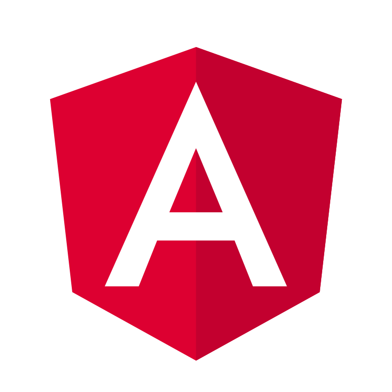

    

<h1 align="center">
  Iniciando com Angular
</h1>

### O que é e para que serve o Angular?

#### Definições gerais:
- É uma plataforma de aplicações web de código aberto baseado em TypeScript;
- Liderado pela equipe do Google, sempre recebe ajuda da comunidade de desenvolvedores e corporações;
- Grandes empresas utilizam o Angular: o próprio Google e os bancos Itaú e Neon;
- É um dos frameworks JavaScript mais populares;
- Utilizado para a criação de sites dinâmicos, web apps, aplicativos e entre outros;
- O Angular é uma reescrita completa do AngularJS, também desenvolvido pelo Google.

#### Compreendendo o Angular:
- Componentes:
  - São pequenos trechos de código que são reutilizados dentro da aplicação;
  - Templates HTML;
  - Styles CSS;
  - Classes em TypeScript.
- Serviços:
  - Uma abstração dos componentes;
  - Criação de uma camada de cache/HTTP;
  - Captura de informações/dados de APIs externas.
- Módulos:
  - Uma abstração para o carregamento/registro dos componentes;
  - Uso do *lazy loading* com o intuito de auxiliar no load "em partes" da aplicação.

#### Pontos positivos:
- Aplicativos de página única (SPA);
- Produtivade;
- Flexibilidade;
- Documentação extensa;
- Testes;
- Compatibilidade com computadores e também dispositivos móveis.

### Conhecendo a documentação
Link para a [documentação](https://angular.io/docs) do Angular e para o [blog](https://vidafullstack.com.br/angular-blog/) do curso.
